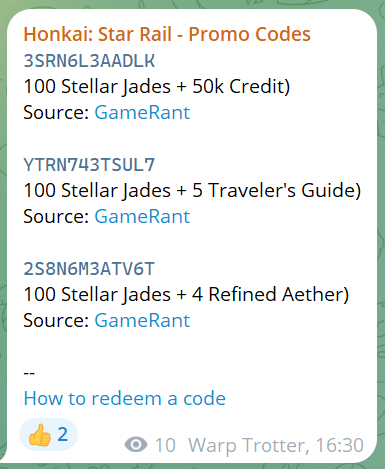

# Promocode Poster

A standalone-script designed to check content of multiple given web-pages in order to find promotion codes and then post findings to Telegram channel.

There are two strategies to scrape a content:

- [puppeteer](https://github.com/puppeteer/puppeteer) - heavy and advansed one, requires more RAM, allows to avoid simpliest bot-protections;
- good old GET-request and [jsdom](https://github.com/jsdom/jsdom) - lightweight and fast, more risky to be blocked though;

## Development

### Prerequisites

- Telegram channel - 1 piece
- Telegram Bot - 1 piece (should be added to the Telegram channel with posting permissions)

### Run a development server locally

1. Clone the repo
1. `cp .env.example .env` and feed secrets
1. `npm i`
1. `npm run dev`

TIP: It's a good practice to create a separate bot-channel pair for development.

## Deployment

There is a docker container with cronjob task prepared. All you need to do:

1. Clone the repo
1. `cp .env.example .env` and feed secrets
1. run `docker compose up -d` to run container in backgroud

## Promocode Poster-powered channels

- [Genshin Impact Codes](https://t.me/genshinimpact_codes)
- [Star Rail Codes](https://t.me/star_rail_codes)
